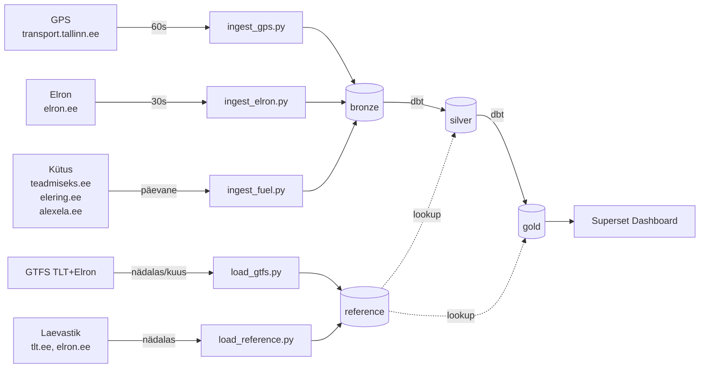

# public-transport-analytics
**Eesti ühistranspordi reaalaja analüüs** — UT Tartu Data Engineering 2026  
Daniil Titov

## Äriküsimus

> **Kuidas toimib Tallinna ja Eesti ühistransport reaalajas — mitu sõidukit on liikvel, mis marsruutidel, ja kas ühistransport on alternatiiv autole?**

Analüüs ühendab TLT GPS andmed, Elroni reaalajas rongide positsioonid,
kütuse- ja elektrihinnad ning GTFS sõiduplaani.

**Lisaavastus:** andmete kombineerimisel osutus võimalikuks arvutada teoreetiline
päevane kütusekulu transpordiliigi järgi (±25% täpsusega).

## Arhitektuur



Täpsem kirjeldus: [docs/arhitektuur.md](docs/arhitektuur.md)

## Stack

| Komponent | Tööriist |
|---|---|
| Andmebaas | pgduckdb (PostgreSQL + DuckDB) |
| Sissevõtt | Python + APScheduler |
| Transformatsioon | dbt-postgres 1.8.0 |
| Dashboard | Apache Superset 6.0.0 |
| Konteineriseerimine | Docker Compose |

## Käivitamine

```bash
git clone https://github.com/danikus555/public-transport-analytics.git
cd public-transport-analytics
cp .env.example .env
# Muuda .env paroolid
docker compose up -d --build
# Oota ~60s
docker exec transport-pipeline python scripts/setup_superset.py
# Dashboard: http://localhost:8088
```

## Andmeallikad

| Allikas | Andmed | Uueneb |
|---|---|---|
| `transport.tallinn.ee/gps.txt` | TLT bussid, trammid | Iga 60s |
| `elron.ee/map_data.json` | Rongide positsioonid, hilinemised | Iga 30s |
| `teadmiseks.ee` | 95, 98, Diesel hinnad | Päevane |
| `dashboard.elering.ee/api/nps/price` | Elektri börsihind | Iga 15min |
| `alexela.ee` | CNG hind | Iganädalane |
| `eu-gtfs.remix.com/tallinn.zip` | TLT 81 marsruuti | Nädalas |
| `eu-gtfs.remix.com/elron.zip` | Elron 28 marsruuti | Kuus |

## Projekti struktuur

```
public-transport-analytics/
├── compose.yml
├── .env.example
├── Dockerfile.pipeline
├── Dockerfile.dbt
├── Dockerfile.superset
├── requirements.pipeline.txt
├── init/
│   ├── 01_schemas.sql
│   └── 02_schemas.sql
├── scripts/
│   ├── scheduler.py
│   ├── ingest_gps.py
│   ├── ingest_elron.py
│   ├── ingest_fuel.py
│   ├── load_gtfs.py
│   ├── load_reference.py
│   ├── setup_superset.py
│   └── logger.py
├── dbt/
│   ├── dbt_project.yml
│   ├── profiles.yml
│   ├── macros/
│   └── models/
│       ├── sources.yml
│       ├── silver/
│       └── gold/
├── docs/
│   ├── arhitektuur.md
│   └── progress.md
└── IN/
    ├── gps/
    ├── elron/
    └── fuel/
```

## Tulemused (Sprint 2)

- **500+ sõidukit** reaalajas kaardil
- **23 Elroni rongi** reaalajas
- **~184,000€/päev** hinnanguline kütusekulu (peaks täpsustama ja testida)
- **109 marsruuti** (81 TLT + 28 Elron)
- **20 sõidukimudelit** tarbimise ja arvuga

## Dashboard kaardi seadistamine (käsitsi)
1. Charts → + Chart → deck.gl Scatter Plot
2. Dataset: gold.latest_positions
3. Query → Longitude & Latitude: lon | lat
4. Map Style: https://tile.openstreetmap.org/{z}/{x}/{y}.png
5. Point Color → dimension: transport_type
6. Row limit: 600
7. filters: transport_type is not null, line number is not null, destination is not null
8. legend: transport_type
9. Save as "Tallinn Transport Map"

## Meeskond

| Nimi | Roll |
|---|---|
| Daniil Titov | Kõik rollid (individuaalne projekt) |