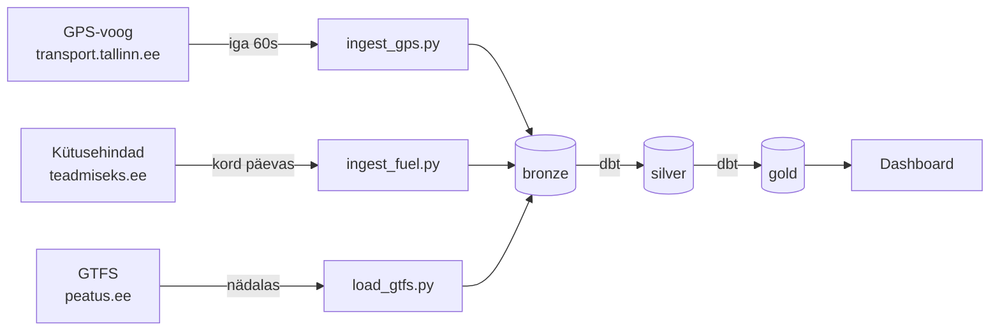

# public-transport-analytics
Tallinn public transport real-time analytics — UT Data Engineering 2026
# Daniil Titov — Tallinna ühistranspordi reaalaja analüüs

## Äriküsimus

Kuidas muutuvad Tallinna TLT ühistranspordi (tramm, buss, troll) sõidukite asukohad reaalajas võrreldes eelmise päevaga ning millised on jooksvad kütusehindade muutused?

**Mõõdikud:**

1. Aktiivsete sõidukite arv liini kaupa tunnis
2. Kütusehind tüübi järgi — diesel, 95, 98 (uueneb kord päevas)

## Arhitektuur



Täpsem kirjeldus: [docs/arhitektuur.md](docs/arhitektuur.md)

## Andmestik

| Allikas | Tüüp | Uuenessagedus |
|---|---|---|
| `transport.tallinn.ee/gps.txt` | Tekstivoog | Iga 10–30 sekundit |
| `teadmiseks.ee` | HTML (scraping) | Kord päevas |
| `peatus.ee/gtfs/gtfs.zip` | ZIP/CSV (GTFS) | Nädalas |

## Stack

| Komponent | Tööriist |
|---|---|
| Sissevõtt | Python skriptid |
| Transformatsioon | dbt Core |
| Andmehoidla | pgduckdb (PostgreSQL) |
| Näidikulaud | Otsustatakse Sprint 2 alguses |
| Konteineriseerimine | Docker Compose |

## Käivitamine

```bash
git clone https://github.com/danikus555/public-transport-analytics.git
cd public-transport-analytics
cp .env.example .env
docker compose up -d --build
```

## Saladused ja konfiguratsioon

- Paroolid hoitakse `.env` failis
- GitHubis on ainult `.env.example`
- Tegelik `.env` on `.gitignore`-s

## Projekti struktuur

```
.
├── README.md
├── compose.yml.example
├── .env.example
├── .gitignore
├── docs/
│   ├── arhitektuur.md
│   └── progress.md
├── scripts/
│   ├── ingest_gps.py
│   ├── ingest_fuel.py
│   └── load_gtfs.py
├── dbt/
└── IN/
    ├── gps/
    └── fuel/
```

## Meeskond

| Nimi | Roll |
|---|---|
| Daniil Titov | Kõik rollid (individuaalne projekt) |
