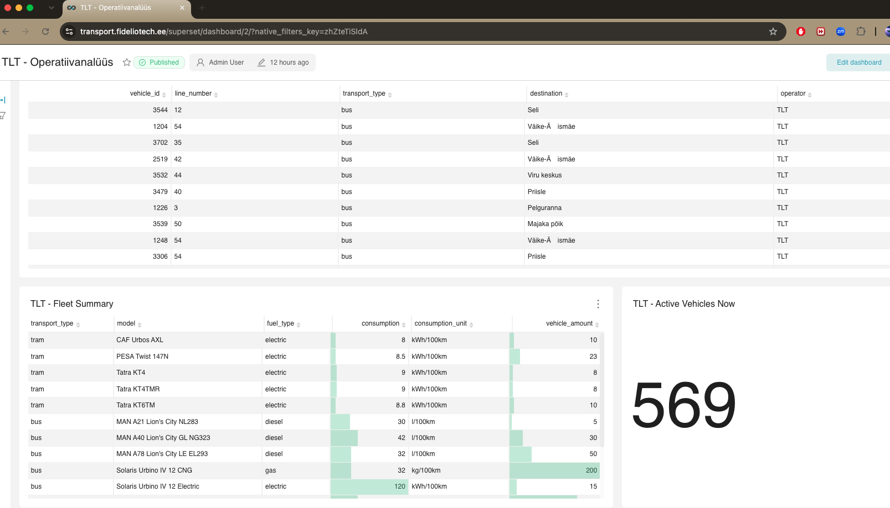
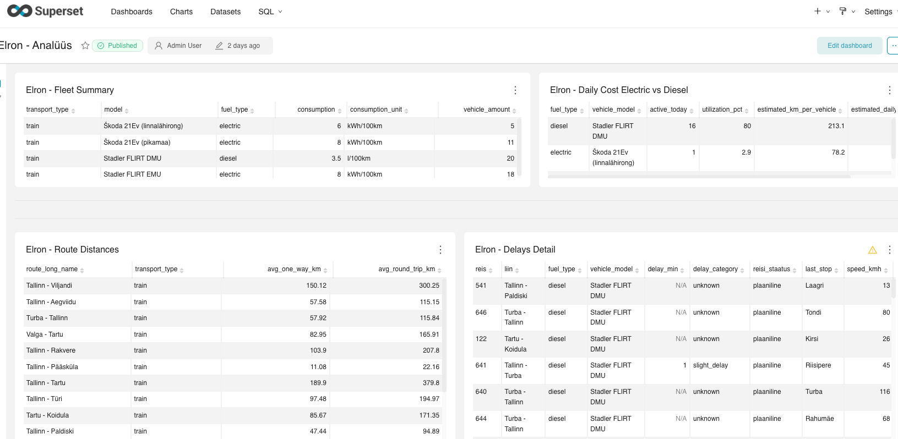
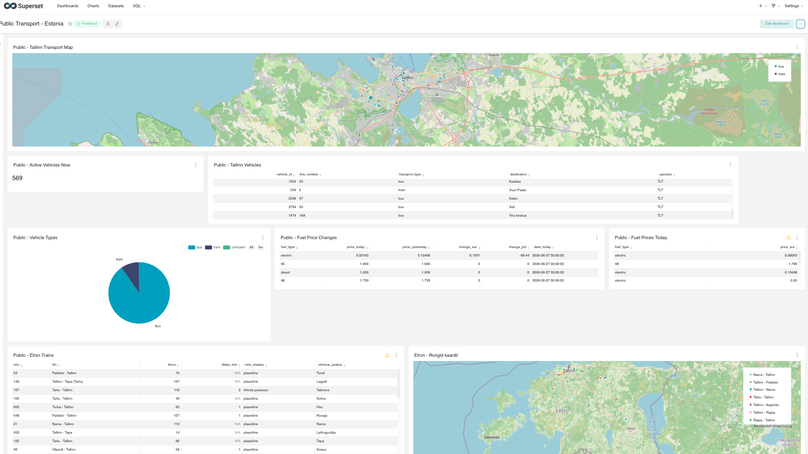
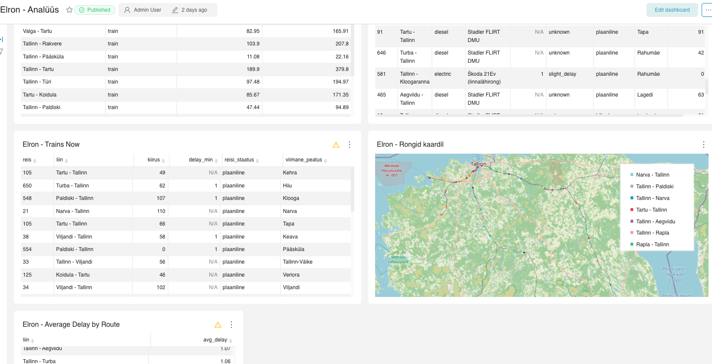
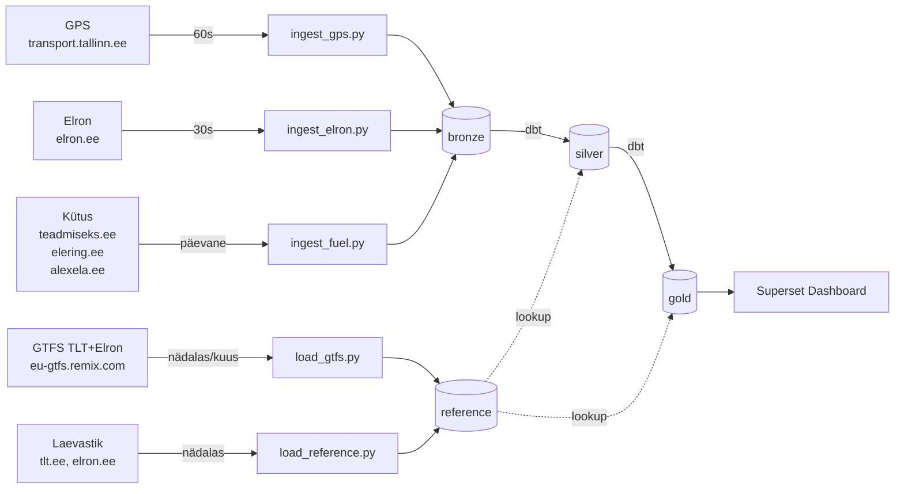

# public-transport-analytics
**Eesti ühistranspordi reaalaja analüüs** — UT Tartu Data Engineering 2026  
Daniil Titov

## Äriküsimus

> **Kuidas toimib Tallinna ja Eesti ühistransport reaalajas — mitu sõidukit on liikvel, mis marsruutidel, kas Elroni rongid sõidavad graafiku järgi, ja kui palju maksab ühistranspordi käitamine päevas?**

Analüüs ühendab TLT GPS andmed, Elroni reaalajas rongide positsioonid,
kütuse- ja elektrihinnad ning GTFS sõiduplaani.

**Avastused andmetega töötades:**
- TLT bussides ei ole võimalik GPS põhjal tuvastada kütuse tüüpi sõiduki tasandil — kütusekulu arvutatakse laevastiku proportsioonide põhjal
- Elroni API tagastab hilinemisandmed otse — ei vaja GTFS-RT-d
- Nord Pool elektri börsihind muutub tunni kaupa (0.003–0.29 €/kWh) — operaatorid kasutavad lepingulist hinda

## Live Demo

**Video:** https://youtu.be/3D02XZF9Rek
**Dashboard:** https://transport.fideliotech.ee

Demovaataja juurdepääs (ainult lugemine):

| Kasutajanimi | Parool | Vaade |
|---|---|---|
| `DataEngineer` | `123` | Kõik 4 näidikulauda |

## Dashboard Screenshots

Projekti screenshotid näidiseks
### Screenshot 1 — TLT Operational Analysis



### Screenshot 2 — Elron Analysis Overview



### Screenshot 3 — Public Transport Estonia Dashboard



### Screenshot 4 — Elron Trains and Route Map



## Arhitektuur


```mermaid
flowchart LR
    A[GPS\ntransport.tallinn.ee] -->|60s| B[ingest_gps.py]
    C[Elron\nelron.ee] -->|30s| D[ingest_elron.py]
    E[Kütus\nteadmiseks.ee\nelering.ee\nalexela.ee] -->|päevane| F[ingest_fuel.py]
    G[GTFS TLT+Elron\neu-gtfs.remix.com] -->|nädalas/kuus| H[load_gtfs.py]
    I[Laevastik\ntlt.ee, elron.ee] -->|nädalas| J[load_reference.py]

    B & D & F --> K[(bronze)]
    H & J --> L[(reference)]

    K -->|dbt| M[(silver)]
    L -.->|lookup| M
    L -.->|lookup| N
    M -->|dbt| N[(gold)]
    N --> O[Superset Dashboard]
```

Täpsem kirjeldus: [docs/arhitektuur.md](docs/arhitektuur.md)

## Stack

| Komponent | Tööriist | Versioon |
|---|---|---|
| Andmebaas | pgduckdb (PostgreSQL + DuckDB) | 18-v1.1.1 |
| Sissevõtt | Python + APScheduler | 3.11 |
| Transformatsioon | dbt-postgres | 1.8.0 |
| Dashboard | Apache Superset | 6.0.0 |
| Konteineriseerimine | Docker Compose | v2 |

## Käivitamine

```bash
git clone https://github.com/danikus555/public-transport-analytics.git
cd public-transport-analytics
cp .env.example .env
# Muuda .env paroolid (vaata .env.example kommentaare)
docker compose up -d
# Oota ~90s kuni Superset initsialiseerub
docker exec transport-pipeline python scripts/setup_superset.py
# Dashboard: http://localhost:8088

# Esimene käivitamine — vajalik üks kord:
docker exec transport-dbt dbt run --full-refresh \
  --select vehicle_positions \
  --project-dir /app/dbt --profiles-dir /app/dbt
docker exec transport-dbt dbt run \
  --project-dir /app/dbt --profiles-dir /app/dbt
```

**Esimene käivitamine:** GTFS laadimine võtab ~5 minutit (1.17M stop_times rida).
Järgnevad käivitamised jätavad vahele kui fail pole muutunud (~2s).

## Kasutajad ja rollid

| Kasutajanimi | Parool (.env) | Roll | Näidikulaud |
|---|---|---|---|
| `admin` | `SUPERSET_ADMIN_PASSWORD` | Admin | Kõik — muuda, kustuta, loo |
| `data_engineer` | `DATA_ENGINEER_PASSWORD` | Admin | Kõik — muuda, kustuta, loo |
| `tlt_analyst` | `TLT_ANALYST_PASSWORD` | Gamma (ainult lugemine) | Kõik avaldatud |
| `elron_analyst` | `ELRON_ANALYST_PASSWORD` | Gamma (ainult lugemine) | Kõik avaldatud |
| `public_user` | `PUBLIC_USER_PASSWORD` | Gamma (ainult lugemine) | Kõik avaldatud |

**Rollide kirjeldus:**
- **Admin** — täielik ligipääs: näidikulaudade loomine, muutmine, kustutamine, kasutajate haldus
- **Gamma** — ainult lugemine: vaatab näidikulaudu, ei saa midagi muuta

**Superset CE piirang:** Gamma roll näeb kõiki avaldatud näidikulaudu — per-näidikulaud
isolatsioon nõuaks Superset Enterprise't või eraldi instantseid. Praeguses lahenduses
kasutab `setup_superset.py` ühte andmeallikat operaatori filtritega (`WHERE operator = 'TLT'`
jne), et kuvada iga näidikulaud ainult asjakohaste andmetega. Näidikulaudade layouti
konfiguratsioon nõuab käsitsi seadistamist Superset UI kaudu pärast automaatset loomist.

## Andmeallikad

| Allikas | Andmed | Uueneb |
|---|---|---|
| `transport.tallinn.ee/gps.txt` | TLT bussid, trammid | Iga 60s |
| `elron.ee/map_data.json` | Rongide positsioonid, hilinemised | Iga 30s |
| `teadmiseks.ee` | 95, 98, Diesel hinnad | Päevane |
| `dashboard.elering.ee/api/nps/price` | Elektri börsihind (Nord Pool) | Iga 15min |
| `alexela.ee` | CNG hind (~4x aastas muutub) | Käsitsi uuendus |
| `eu-gtfs.remix.com/tallinn.zip` | TLT 81 marsruuti + shapes | Nädalas |
| `eu-gtfs.remix.com/elron.zip` | Elron 28 marsruuti + shapes | Kuus |

## dbt mudelid

| Mudel | Kiht | Kirjeldus |
|---|---|---|
| `vehicle_positions` | silver | GPS + GTFS join, enkodeering parandatud |
| `elron_positions` | silver | Elron + kütuse tüüp, deduplitseeritud |
| `latest_positions` | gold | Viimane positsioon iga sõiduki kohta |
| `fleet_summary` | gold | Laevastiku kokkuvõte mudeli järgi |
| `fuel_cost_daily` | gold | Päevane kütusekulu operaatori ja kütuse tüübi järgi |
| `fuel_daily` | gold | Kütusehinna muutus eelmise päevaga |
| `fuel_with_discount` | gold | Lepingulised hinnad vs börsihind |
| `route_activity` | gold | Aktiivsed sõidukid liini ja tunni järgi (7 päeva) |
| `route_distances` | gold | Tegelik marsruudi pikkus GTFS shapes põhjal |
| `route_daily_km` | gold | Planeeritud päevased km nädalapäeva järgi |
| `elron_delays` | gold | Elroni hilinemised reaalajas |
| `vehicle_delays` | gold | TLT sõidukite lähedus peatustele |
| `vehicle_speed` | gold | Sõidukiiruse ja ummiku tuvastus |

## Andmekvaliteedi testid

```bash
docker exec transport-dbt dbt test --project-dir /app/dbt --profiles-dir /app/dbt
# Tulemus: PASS=28 WARN=0 ERROR=0
```

| Test | Tabel | Veerg |
|---|---|---|
| `not_null` | bronze.vehicle_positions | vehicle_id, lat, lon, ingested_at, operator |
| `not_null` | bronze.elron_positions | liin, lat, lon |
| `not_null` | bronze.fuel_prices | fuel_type, price_eur |
| `not_null` + `unique` | reference.vehicle_models | id, model, consumption |
| `accepted_values` | bronze.vehicle_positions | operator IN ('TLT', 'Elron') |
| `accepted_values` | bronze.fuel_prices | fuel_type IN ('95','98','Diesel','electric','CNG') |
| `not_null` + `unique` | bronze.client_discounts | company, fuel_type |
| `not_null` | gold.fuel_cost_daily | operator, estimated_daily_cost_eur, utilization_pct |
| `not_null` + `accepted_values` | gold.elron_delays | liin, delay_min, delay_category |
| `not_null` + `unique` | gold.latest_positions | vehicle_id, lat, lon |

## Tulemused (Sprint 3)

| Mõõdik | Väärtus |
|---|---|
| dbt mudelid | 13 |
| dbt testid | PASS=28 WARN=0 ERROR=0 |
| dbt run aeg | **4.42s** (oli 578s) |
| TLT aktiivsed sõidukid (päeval) | ~460–580 |
| Elroni aktiivsed rongid (päeval) | 11–20 |
| TLT busside kütusekulu | ~47,000–50,000 €/päev |
| Elroni kütusekulu | ~700–1,100 €/päev |
| Näidikulaudu | 4 |
| Graafikuid | 35 |

## Projekti struktuur

```
public-transport-analytics/
├── compose.yaml
├── .env.example
├── Dockerfile.pipeline
├── Dockerfile.dbt
├── Dockerfile.superset
├── superset_config.py
├── requirements_pipeline.txt
├── init/
│   ├── 01_schemas.sql          # bronze, silver, gold, reference skeemid
│   ├── 02_schemas.sql          # gold täiendavad tabelid
│   ├── 03_schemas_shapes.sql   # GTFS shapes tabel
│   └── 04–10_*.sql             # migratsioonid (Elron kütuse tüübid, laevastik)
├── scripts/
│   ├── scheduler.py            # APScheduler — kõik jobid
│   ├── ingest_gps.py           # TLT GPS sissevõtt
│   ├── ingest_elron.py         # Elroni rongide sissevõtt
│   ├── ingest_fuel.py          # Kütusehindade sissevõtt
│   ├── load_gtfs.py            # GTFS sõiduplaani laadimine
│   ├── load_reference.py       # Staatiliste andmete laadimine
│   ├── setup_superset.py       # Superset automaatne seadistamine
│   ├── cleanup_superset.py     # Duplikaatgraafikute puhastamine
│   └── logger.py               # Loguru 3-kanalilne logimine
├── dbt/
│   ├── dbt_project.yml
│   ├── profiles.yml
│   ├── macros/
│   └── models/
│       ├── sources.yml
│       ├── gold/
│       │   └── gold.yml        # gold kihi testid
│       ├── silver/
│       └── gold/
└── docs/
    ├── arhitektuur.md
    └── progress.md
```

## Puudused

- **TLT hilinemised:** TLT GPS-il puudub graafikust kõrvalekalde väli — bussid/trammid näitavad ainult lähedust peatusele (500m), mitte tegelikku hilinemist
- **CNG hind:** Alexela CNG lehekülg kasutab JavaScripti — automaatne scraping ei toimi; hind uuendatakse käsitsi DB-s
- **Superset CE ligipääsu kontroll:** Superset Community Edition Gamma roll näeb kõiki avaldatud näidikulaudu — per-näidikulaud isolatsioon nõuab Superset Enterprise't. Praegu kasutatakse ühte `setup_superset.py` skripti, mis loob eraldi graafikud iga näidikulaua jaoks operaatori filtritega (WHERE operator = 'TLT/Elron'). Samas graafikuid ja näidikulaudu saab API kaudu automaatselt luua, kuid layouti (paigutuse) konfiguratsioon nõuab käsitsi seadistamist Superset UI-s. Täiustuseks oleks võimalik kasutada eraldi Superset instantseid iga rolli jaoks või spetsiifilisi row-level security reegleid.
- **Kütusekulu täpsus:** ±20-30% — nominaalne tarbimine tootja andmetest, GTFS planeeritud km (mitte tegelikult sõidetud)
- **Elektri hind:** Nord Pool börsihind on volatiilne; tegelik operaatori hind on `fuel_with_discount` tabelis lepinguliste hindadena
- **Ühe sõlme arhitektuur:** pgduckdb töötab ühe konteinerina ilma replikatsioonita

## Meeskond

| Nimi | Roll |
|---|---|
| Daniil Titov | Kõik rollid (individuaalne projekt) |