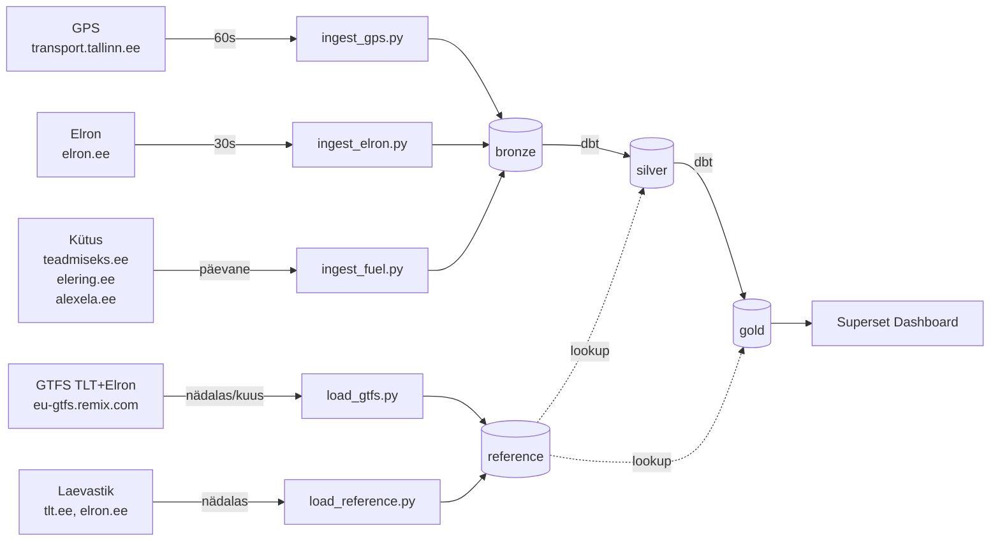

# Arhitektuur

## Äriküsimus

**Kuidas toimib Tallinna ja Eesti ühistransport reaalajas?**

Analüüs vastab küsimustele:
- Mitu bussi, trammi ja rongi on praegu liikvel?
- Millistel marsruutidel ja mis suunas?
- Kas Elroni rongid sõidavad graafiku järgi?
- Kas täna tasub kasutada ühistransporti või autot?

**Lisaavastus arenduse käigus:**
Andmete kombineerimisel (GPS + GTFS + kütusehindade + sõidukimudelid)
osutus võimalikuks arvutada teoreetiline päevane kütusekulu transpordiliigi järgi.
See on täiendav mõõdik, mitte põhiküsimus. Täpsus ±25% (nominaalne tarbimine,
hinnanguline km — täpsustatakse Sprint 3-s GTFS shapes.txt-ga).

## Andmevoog

**Märkus:** `reference` on staatiline lookup kiht — ei ole andmevoo osa aga
dbt mudelid kasutavad seda JOIN-ides (sõidukimudelid, GTFS marsruudid, kütuse tüübid).

## Andmeallikad

| Allikas | Formaat | Uueneb | Kirjeldus |
|---|---|---|---|
| `transport.tallinn.ee/gps.txt` | CSV tekstivoog | Iga 60s | TLT bussid, trammid |
| `elron.ee/map_data.json` | JSON API | Iga 30s | Rongide positsioonid, hilinemised |
| `teadmiseks.ee` | HTML scraping | Päevane | 95, 98, Diesel hinnad |
| `dashboard.elering.ee/api/nps/price` | JSON API | Iga 15min | Elektri börsihind |
| `alexela.ee` | HTML scraping | Iganädalane | CNG hind |
| `eu-gtfs.remix.com/tallinn.zip` | GTFS ZIP | Nädalas | TLT 81 marsruuti |
| `eu-gtfs.remix.com/elron.zip` | GTFS ZIP | Kuus | Elron 28 marsruuti |

## Andmebaasi kihid

| Kiht | Skeem | Sisu | Uueneb |
|---|---|---|---|
| Reference | `reference` | Staatilised lookup tabelid: sõidukimudelid, GTFS, kütuse tüübid | Nädalas |
| Bronze | `bronze` | Toorandmed muutmata kujul allikast | Reaalajas |
| Silver | `silver` | Puhastatud + GTFS-ga rikastatud (transport_type, fuel_type) | dbt iga 5min |
| Gold | `gold` | Analüütika: aktiivsed sõidukid, kütusekulu, hilinemised | dbt iga 5min |

## Andmebaasi tabelid

### Reference (staatilised lookup andmed)
- `reference.operators` — TLT, Elron, SEBE
- `reference.vehicle_models` — 20 sõidukimudelit koos tarbimise ja arvuga
- `reference.fuel_types` — diesel, 95, 98, electric, gas, hybrid_diesel
- `reference.line_types` — tram, bus, trolleybus
- `reference.gtfs_routes` — 109 marsruuti (81 TLT + 28 Elron)
- `reference.gtfs_stops` — 18,062 peatust koordinaatidega
- `reference.gtfs_trips` — 51,502 reisi
- `reference.gtfs_stop_times` — 1,199,440 graafikukirjet
- `reference.elron_line_types` — Elroni liinide kütuse kaardistus

### Bronze (toorandmed)
- `bronze.vehicle_positions` — TLT GPS snapshots (iga 60s)
- `bronze.elron_positions` — Elroni rongide positsioonid (iga 30s)
- `bronze.fuel_prices` — kütuse- ja elektrihinnad
- `bronze.client_discounts` — operaatorite lepingulised soodustused

### Silver (dbt — puhastatud)
- `silver.vehicle_positions` — GPS + GTFS join (transport_type, fuel_type)
- `silver.elron_positions` — Elron + kütuse tüüp

### Gold (dbt — analüütika)
- `gold.latest_positions` — viimane positsioon iga sõiduki kohta
- `gold.fleet_summary` — laevastiku kokkuvõte mudeli järgi
- `gold.fuel_cost_daily` — päevane kütusekulu transpordiliigi järgi
- `gold.fuel_daily` — kütusehinna muutus eelmise päevaga
- `gold.route_activity` — aktiivsed sõidukid liini ja tunni järgi

## Stack

| Komponent | Tööriist | Versioon |
|---|---|---|
| Andmebaas | pgduckdb (PostgreSQL + DuckDB) | 18-v1.1.1 |
| Sissevõtt | Python + APScheduler | 3.11 |
| Transformatsioon | dbt-postgres | 1.8.0 |
| Dashboard | Apache Superset | 6.0.0 |
| Konteineriseerimine | Docker Compose | v2 |

## Öörežiim

Scheduler peatab GPS ja Elroni sissevõtu 00:00–06:00:
- Vähem loge ja ressursikasutust
- GTFS, kütus ja reference uuendused toimuvad varahommikul (03:00–03:30)

## Jõudlus

| Toiming | Aeg |
|---|---|
| GTFS esialgne laadimine | ~5 min (1.17M stop_times rida) |
| GTFS järgnevad käivitamised | ~2s (version check, skip kui sama) |
| GPS ingest | ~150ms |
| Elron ingest | ~70ms |
| dbt run (7 mudelit) | ~4-15s |

## Kütusekulu mudeli piirangud

| Piirang | Selgitus | Sprint 3 plaan |
|---|---|---|
| Nominaalne tarbimine | Tootja andmed, mitte tegelik | GPS kiiruse põhine korrektsiooni |
| Hinnanguline km | 225km/päev buss, 800km/päev rong | GTFS shapes.txt täpne pikkus |
| Elektri börsihind | 0.003 €/kWh, mitte tegelik tarbijahind | Lepinguline hind client_discounts tabelisse |

## Privaatsus ja turve

Kõik andmed on avalikud — ei sisalda isikuandmeid.
- Paroolid hoitakse `.env` failis
- GitHubis on ainult `.env.example`
- Dashboard parool seadistatakse `.env`-s