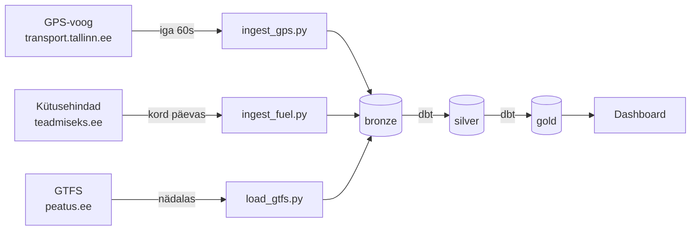

# Arhitektuur

## Äriküsimus

Kuidas muutuvad Tallinna TLT ühistranspordi (tramm, buss, troll) sõidukite asukohad reaalajas võrreldes eelmise päevaga ning millised on jooksvad kütusehindade muutused?

## Mõõdikud

1. **Aktiivsete sõidukite arv liini kaupa** — unikaalsete sõidukite arv konkreetsel marsruudil tunnis (`COUNT(DISTINCT vehicle_id)` gruppides `route_id` ja `hour` järgi)
2. **Kütusehind tüübi järgi** — diesel, 95 ja 98 jooksev hind eurodes liitri kohta, uueneb kord päevas

## Andmeallikad

| Allikas | Formaat | Uuenessagedus | Muutuvus |
|---|---|---|---|
| `transport.tallinn.ee/gps.txt` | Tekstivoog (CSV) | Iga 10–30 sekundit | Pidevalt muutuv |
| `teadmiseks.ee` | HTML (scraping) | Kord päevas | Päevane muutus |
| `peatus.ee/gtfs/gtfs.zip` | ZIP/CSV (GTFS) | Nädalas | Praktiliselt staatiline |

Ligipääs kontrollitud: GPS-voog vastab, `teadmiseks.ee` avalikult ligipääsetav, GTFS-fail allalaaditav.

## Andmevoog

## Andmebaasi kihid

| Kiht | Skeem | Sisu |
|---|---|---|
| Bronze | `bronze` | Toorandmed täpselt nii nagu allikast saadi, koos `ingested_at` ajatempliga |
| Silver | `silver` | Puhastatud, tüübitud, deduplitseeritud (dbt) |
| Gold | `gold` | Agregaadid — aktiivsed sõidukid liini kaupa, kütusehindade ajalugu (dbt) |

## Tööjaotus

Projekt on individuaalne — kõik rollid täidab Daniil Titov.

| Roll | Vastutus |
|---|---|
| Andmeallika omanik | GPS, kütus, GTFS sissevõtt |
| Transformatsioonide omanik | dbt mudelid bronze → silver → gold |
| Kvaliteedi omanik | dbt testid, pytest |
| Näidikulaua omanik | Dashboard, rollid |

## Riskid

| Risk | Maandamine |
|---|---|
| `transport.tallinn.ee/gps.txt` läheb alla või muudab formaati | Salvestada toorvastus bronze-kihti; vea puhul logida ja jätkata |
| `teadmiseks.ee` muudab HTML-struktuuri | Testida CSS-selektoreid Sprint 2 alguses; vajadusel kasutada staatilisi snapshot-faile |

## Privaatsus ja turve

Kõik andmed on avalikud — ei sisalda isikuandmeid.

- Paroolid ja seaded hoitakse `.env` failis
- GitHubis on ainult `.env.example` — tegelik `.env` on `.gitignore`-s
- Dashboard parool seadistatakse esimesel käivitamisel
