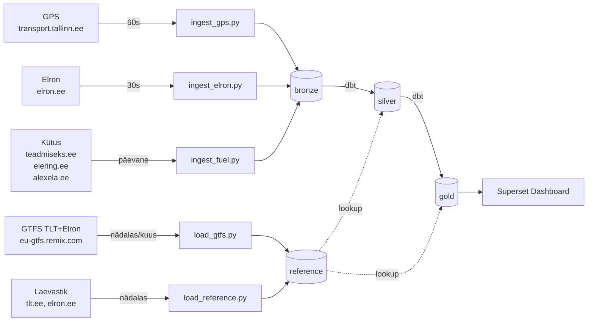

# Arhitektuur

## Äriküsimus

**Kuidas toimib Tallinna ja Eesti ühistransport reaalajas?**

Analüüs vastab küsimustele:
- Mitu bussi, trammi ja rongi on praegu liikvel?
- Millistel marsruutidel ja mis suunas?
- Kas Elroni rongid sõidavad graafiku järgi?
- Kui palju maksab ühistranspordi käitamine päevas kütuses?
- Kus on praegu liiklusummikud?

**Avastused arenduse käigus:**
- TLT GPS ei sisalda kütuse tüüpi ega hilinemist — bussikütusekulu arvutatakse laevastiku proportsioonidena
- Elroni API tagastab hilinemisandmed otse (`erinevus` väli) — ei vaja GTFS-RT-d
- Nord Pool elektri börsihind on tunni kaupa volatiilne — operaatorid kasutavad lepingulist hinda

## Andmevoog

```mermaid
flowchart LR
    A[GPS\ntransport.tallinn.ee] -->|60s| B[ingest_gps.py]
    C[Elron\nelron.ee] -->|30s| D[ingest_elron.py]
    E[Kütus\nteadmiseks.ee\nelering.ee\nalexela.ee] -->|päevane| F[ingest_fuel.py]
    G[GTFS TLT+Elron\neu-gtfs.remix.com] -->|nädalas/kuus| H[load_gtfs.py]
    I[Laevastik\ntlt.ee, elron.ee] -->|nädalas| J[load_reference.py]

    B & D & F --> K[(bronze)]
    H & J --> L[(reference)]

    K -->|dbt| M[(silver)]
    L -.->|lookup| M
    L -.->|lookup| N
    M -->|dbt| N[(gold)]
    N --> O[Superset Dashboard]
```

**Märkus:** `reference` on staatiline lookup kiht — dbt mudelid kasutavad seda
JOIN-ides (sõidukimudelid, GTFS marsruudid, kütuse tüübid).

## Andmeallikad

| Allikas | Formaat | Uueneb | Kirjeldus |
|---|---|---|---|
| `transport.tallinn.ee/gps.txt` | CSV tekstivoog | Iga 60s | TLT bussid, trammid |
| `elron.ee/map_data.json` | JSON API | Iga 30s | Rongide positsioonid, hilinemised |
| `teadmiseks.ee` | HTML scraping | Päevane | 95, 98, Diesel hinnad |
| `dashboard.elering.ee/api/nps/price` | JSON API | Iga 15min | Elektri börsihind |
| `alexela.ee` | Käsitsi uuendus | ~4x aastas | CNG hind (JS-põhine leht) |
| `eu-gtfs.remix.com/tallinn.zip` | GTFS ZIP | Nädalas | TLT 81 marsruuti + shapes |
| `eu-gtfs.remix.com/elron.zip` | GTFS ZIP | Kuus | Elron 28 marsruuti + shapes |

## Andmebaasi kihid

| Kiht | Skeem | Sisu | Uueneb |
|---|---|---|---|
| Reference | `reference` | Staatilised lookup tabelid: sõidukimudelid, GTFS, kütuse tüübid | Nädalas |
| Bronze | `bronze` | Toorandmed muutmata kujul allikast | Reaalajas |
| Silver | `silver` | Puhastatud + GTFS-ga rikastatud (transport_type, fuel_type) | dbt iga 5min |
| Gold | `gold` | Analüütika: aktiivsed sõidukid, kütusekulu, hilinemised | dbt iga 5min |

## Andmebaasi tabelid

### Reference (staatilised lookup andmed)
- `reference.operators` — TLT, Elron, SEBE
- `reference.vehicle_models` — 19 sõidukimudelit koos tarbimise ja arvuga
- `reference.fuel_types` — diesel, 95, 98, electric, gas, hybrid_diesel
- `reference.line_types` — tram, bus, trolleybus, train
- `reference.elron_line_types` — Elroni liinide kütuse ja mudeli kaardistus
- `reference.gtfs_routes` — 109 marsruuti (81 TLT + 28 Elron)
- `reference.gtfs_stops` — 18,062 peatust koordinaatidega
- `reference.gtfs_trips` — 51,502 reisi
- `reference.gtfs_stop_times` — 1,199,440 graafikukirjet
- `reference.gtfs_shapes` — 56,177 kujupunkti (TLT + Elron marsruudid)
- `reference.client_discounts` — operaatorite lepingulised soodustused

### Bronze (toorandmed)
- `bronze.vehicle_positions` — TLT GPS hetktõmmised (iga 60s, 7 päeva säilitamine)
- `bronze.elron_positions` — Elroni rongide positsioonid (iga 30s, 7 päeva säilitamine)
- `bronze.fuel_prices` — kütuse- ja elektrihinnad

### Silver (dbt — puhastatud)
- `silver.vehicle_positions` — GPS + GTFS join; inkrementaalne (unique_key: id)
- `silver.elron_positions` — Elron + kütuse tüüp; deduplitseeritud

### Gold (dbt — analüütika)
- `gold.latest_positions` — viimane positsioon iga sõiduki kohta
- `gold.fleet_summary` — laevastiku kokkuvõte mudeli järgi
- `gold.fuel_cost_daily` — päevane kütusekulu transpordiliigi ja operaatori järgi
- `gold.fuel_daily` — kütusehinna muutus eelmise päevaga
- `gold.fuel_with_discount` — lepingulised hinnad vs börsihind
- `gold.route_activity` — aktiivsed sõidukid liini ja tunni järgi (7 päeva)
- `gold.route_distances` — tegelik marsruudi pikkus GTFS shapes põhjal
- `gold.route_daily_km` — planeeritud päevased km nädalapäeva järgi
- `gold.elron_delays` — Elroni hilinemised reaalajas (deduplitseeritud)
- `gold.vehicle_delays` — TLT sõidukite lähedus peatustele (500m raadius)
- `gold.vehicle_speed` — sõidukiiruse ja ummiku tuvastus (2h aken)

## Stack

| Komponent | Tööriist | Versioon |
|---|---|---|
| Andmebaas | pgduckdb (PostgreSQL + DuckDB) | 18-v1.1.1 |
| Sissevõtt | Python + APScheduler | 3.11 |
| Transformatsioon | dbt-postgres | 1.8.0 |
| Dashboard | Apache Superset | 6.0.0 |
| Konteineriseerimine | Docker Compose | v2 |

## Öörežiim

Scheduler peatab GPS ja Elroni sissevõtu 00:00–06:00 EEST:
- Vähem loge ja ressursikasutust
- GTFS, kütus ja reference uuendused toimuvad varahommikul (03:00–03:30)
- Bronze puhastus iga päev 03:30 (säilitamine 7 päeva)

## Jõudlus (Sprint 3 lõpp)

| Toiming | Aeg |
|---|---|
| GTFS esialgne laadimine | ~5 min (1.17M stop_times rida) |
| GTFS järgnevad käivitamised | ~2s (version check, skip kui sama) |
| GPS ingest | ~150ms |
| Elron ingest | ~70ms |
| dbt run (13 mudelit) | **4.42s** (oli 578s) |
| `silver.vehicle_positions` | **1s** (oli 245s, inkrementaalne) |
| `gold.vehicle_speed` | **0.5s** (oli 333s, tasapinnaline valem + 2h eelfilter) |

## Kütusekulu mudeli metoodika

**TLT bussid (`mixed`):**
Kütusekulu arvutatakse laevastiku proportsioonide põhjal (CNG/diesel/elekter/hübriid osakaalud
`reference.vehicle_models` tabelist). GPS ei suuda tuvastada üksiku bussi kütuse tüüpi.

**TLT trammid:**
Alati elekter. Kasutab Nord Pool börsihinda (või `fuel_with_discount` lepingulist hinda).

**Elroni rongid:**
Jaotatakse `reference.elron_line_types` põhjal diesel ja elektri liinideks.
Kaugused GTFS shapes geomeetriast.

**Kütuse hinnad:**
- Diesel, 95, 98: teadmiseks.ee (päevane)
- Elekter: Elering Nord Pool API (volatiilne, lepinguline override `client_discounts`)
- CNG: Alexela (käsitsi uuendus, ~1.199 €/kg mai 2026)

## Privaatsus ja turve

Kõik andmed on avalikud — ei sisalda isikuandmeid.
- Paroolid hoitakse `.env` failis (GitHubis ainult `.env.example`)
- Superset kasutajad luuakse automaatselt `setup_superset.py` poolt
- Dashboard nõuab sisselogimist (Gamma roll — ainult lugemine)